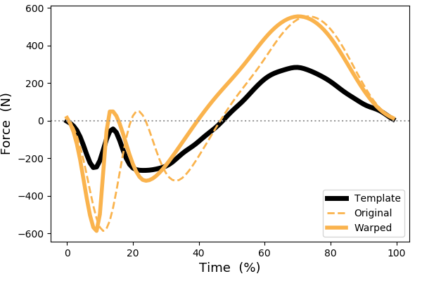

# mwarp1d
Manual one-dimensional data warping and nonlinear registration in Python and PyQt

## Overview

**mwarp1d** provides a collection of GUI and scripting tools for manually [warping](https://en.wikipedia.org/wiki/Image_warping) 1D data, mainly for the purpose of [nonlinear registration](https://en.wikipedia.org/wiki/Image_registration). As alternatives, a variety of algorithmic approaches to nonlinear 1D registration are available including:

* [Minimium eigenvalue](http://www.psych.mcgill.ca/misc/fda/) (Ramsay & Silverman 2005)
* [Fisher-Rao square root velocity transform](Fisher-Rao square root velocity transform <http://ssamg.stat.fsu.edu/software) (Srivastava, Jermyn, & Joshi 2007)
* [K-mean alignment](https://cran.r-project.org/web/packages/fdakma/index.html) (Parodi et al. 2014)
* [Multi-level clusters](https://github.com/julia-wrobel/registr) (Wrobelm 2018)

Please cite:

Pataky TC, Naouma H, Donnelly CJ (in review). mwarp1d: Manual one-dimensional data warping in Python and PyQt. Journal of Open Source Software. [Journal of Open Source Software](https://joss.theoj.org).

## Documentation

Full documentation available at:  [www.spm1d.org/mwarp1d](http://www.spm1d.org/mwarp1d/index.html)

The main documentation sections are:

* [Installation](http://www.spm1d.org/mwarp1d/installation.html)
* [Quick start](http://www.spm1d.org/mwarp1d/quickstart.html) (Screencasts)
* [User manual](http://www.spm1d.org/mwarp1d/usermanual.html)
* [Scripting examples](http://www.spm1d.org/mwarp1d/examples.html)
* [API](http://www.spm1d.org/mwarp1d/api.html)
* [Support](http://www.spm1d.org/mwarp1d/support.html)

