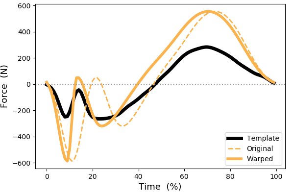

# Summary

["Warping"](https://en.wikipedia.org/wiki/Image_warping) is a mathematical / computational process that transforms a domain like time or space so that its nodes (i.e., points in time or space) are unqeually spaced. For one-dimensional (1D) domains like time, warping involves translating nodes forward or backward (in time). The goal of warping is usually ["registration"](https://en.wikipedia.org/wiki/Image_registration), or the alignment of homologous events / features. An example is shown in Fig.1 below, where an original 1D observation is warped to become better aligned with a template 1D observation.

Warping 1D data has been shown to be necessary for minimizing variability in a variety of applications [@Ramsay1998], yet only a few open-source algorithms, and no manual techniques, exist for 1D registration. It has separately been shown that, for 2D data, manual registration can perform as well as, and in some cases better than algorithmic registration. Manual registration may also be necessary when algorithmic registration fails.

``mwarp1d`` is a tool for manually warping 1D data via Python scripting and also via a PyQt graphical user interface (GUI). ``mwarp1d`` implements two warping procedures: `landmark` and `manual`. Landmark registration was introduced to the literature more than 20 years ago, involving homologous point digitizing and subsequent piecewise interpolation. While simple, landmark registration was implemented as a comparative baseline. The `manual` registration scheme is novel, involving domain warps through manually adjustable, globally-constrained asymmetric Gaussian warping kernels.

# Statement of need

**Research purpose**:  `mwarp1d` allows users to manually register 1D datasets, thereby achieving qualitatively optimal alignment of multiple 1D observations.

**Problem solved**:  `mwarp1d` allows users to manually define arbitrarily complex warps, thereby solving the problem of potentially poor algorithmic registration performance. As far as we are aware, no other manual, GUI-based software exists for manual 1D data warping.

**Target audience**: The target audience is anyone working with or analyzing registerable 1D data, especially researchers in the human and animal movement sciences.

# Figures

Figure 1: Example 1D warp.

# References

